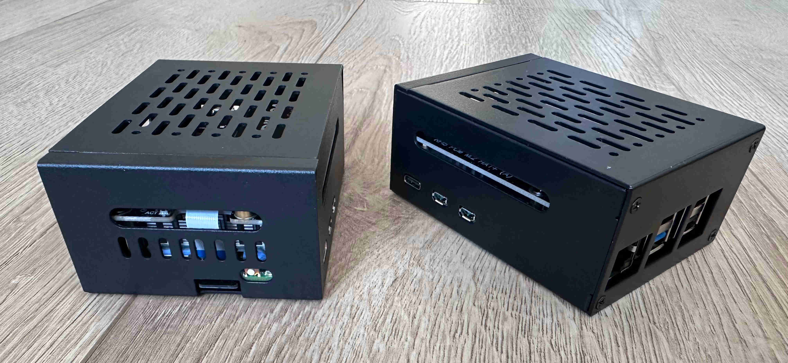
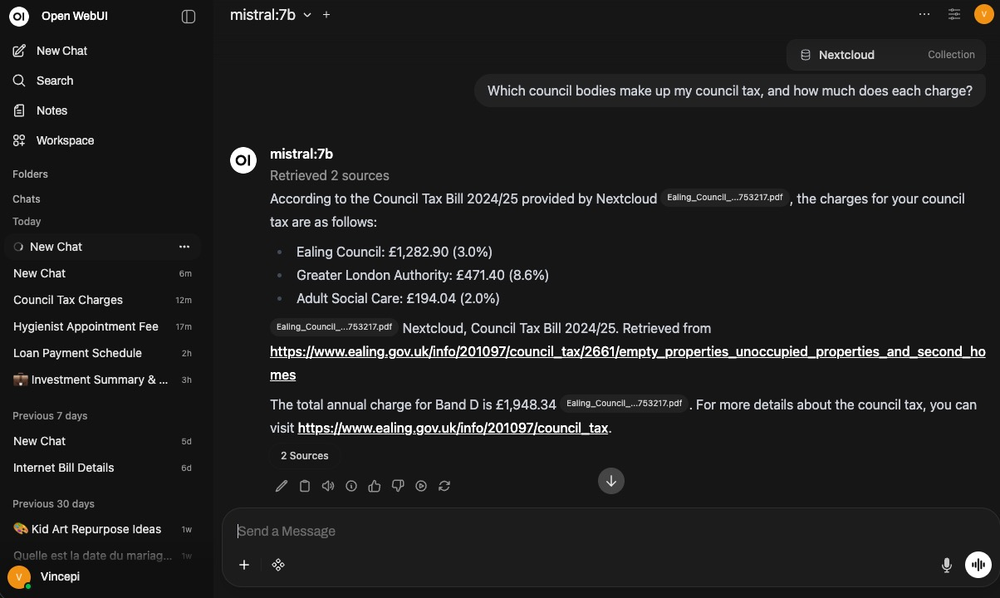
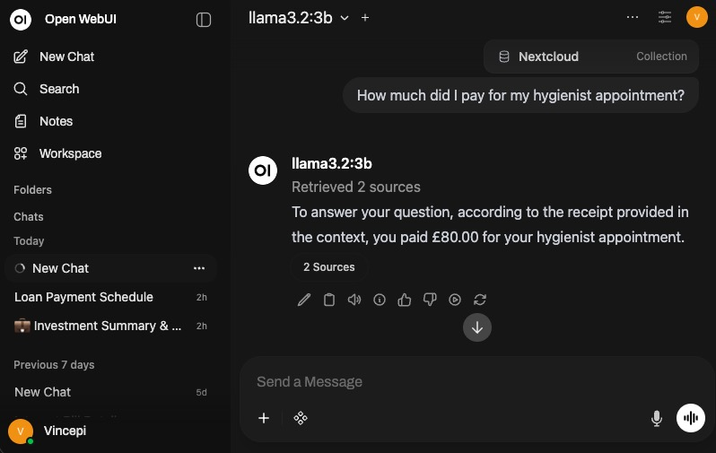
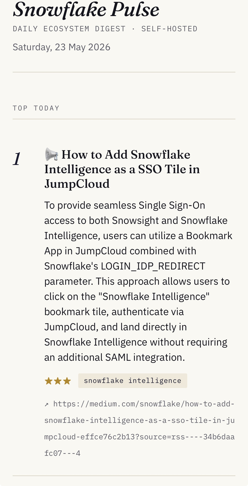

<div align="center">

#  Pi Homelab

### Private Cloud & Local AI on Raspberry Pi 5

*Your data. Your hardware. Your rules.*

<br/>

[](./LICENSE)
[](https://www.raspberrypi.com/)
[](https://tailscale.com/)
[](https://mullvad.net/)
[](https://nextcloud.com/)
[](https://ollama.com/)
[](https://openwebui.com/)
[](https://docker.com/)

<br/>



*pi1 & pi2 side by side*

</div>

---

## Why

Cloud AI and cloud storage are convenient. They're also a continuous decision on your behalf: where your data lives, who can access it, what happens to it, and how much it costs next quarter.

**API pricing shifts. Data residency regulations evolve. Vendor lock-in compounds.** These aren't hypothetical concerns — they're active risks, especially for anyone operating in a regulated industry or across jurisdictions.

This stack addresses them directly: LLM inference runs on your hardware, files are stored on your own server, and all access goes through an encrypted tunnel you control. No data leaves your network. No usage limits. No third-party dependency on the inference path.

---

## Architecture

```
┌─────────────────────────────┐
│   iPhone  /  iPad  /  Mac   │
│   • Tailscale client        │
│   • Nextcloud iOS app       │
│   • Open WebUI (browser)    │
└──────────┬──────────────────┘
           │  WireGuard (Tailscale mesh)
           │
     ┌─────┴──────────────────────────────────────────┐
     │              Raspberry Pi 1                    │
     │         VPN Exit Node & Personal Cloud         │
     │         LAN: 192.168.1.50 / NVMe               │
     │                                                │
     │  ┌──────────────┐   ┌────────────────────┐     │
     │  │  Mullvad VPN │   │     Nextcloud      │     │
     │  │  Swiss exit  │   │  Nginx · MariaDB   │     │
     │  │  nft watchdog│   │  Docker · TLS      │     │
     │  └──────────────┘   └────────────────────┘     │
     └─────────────────────────┬──────────────────────┘
                               │  WebDAV over Tailscale
                               │
     ┌─────────────────────────┴──────────────────────┐
     │              Raspberry Pi 2                    │
     │             Local LLM Node                     │
     │         LAN: 192.168.1.52 / NVMe               │
     │                                                │
     │  ┌──────────────┐   ┌────────────────────┐     │
     │  │    Ollama    │   │    Open WebUI      │     │
     │  │  llama3.2:3b │   │  Nginx · Docker    │     │
     │  │  mistral:7b  │   │  TLS · RAG KB      │     │
     │  │  qwen2.5:7b  │   └────────────────────┘     │
     │  └──────────────┘                              │
     │  /mnt/nextcloud ←── davfs2 + nc-sync.py        │
     └────────────────────────────────────────────────┘
```

**Exit node flow:** `Device → Tailscale → Pi 1 → Mullvad WireGuard → Internet (Swiss IP)`

**LLM flow:** `Device → Tailscale → Pi 2 → Open WebUI → Ollama`

**RAG flow:** `Pi 1 Nextcloud → WebDAV → Pi 2 /mnt/nextcloud → nc-knowledge-sync.py → Open WebUI KB`

**Notifier flow:** `Pi 2 (08:00 timer) → Snowflake docs + Medium → Ollama llama3.2:3b → digest HTML → ntfy (Pi 1) → iPhone / macOS`

---

## Nodes

###  Pi 1 — VPN Exit Node & Personal Cloud

→ [Full setup guide](./pi1-vpn-exit-node/guide.md)


| Service | Role |
|---|---|
| **Mullvad VPN** | WireGuard tunnel — all client traffic exits via Swiss IP |
| **Tailscale** | Encrypted mesh, exit node, subnet router (`192.168.1.0/24`) |
| **Nextcloud** | Private file sync — replaces iCloud / OneDrive / Google Drive |
| **Nginx** | Reverse proxy + TLS termination |
| **MariaDB** | Nextcloud database |
| **ntfy** | Self-hosted push notification server (iOS / macOS delivery) |
| **nftables watchdog** | Keeps `tailscale0` rules intact across Mullvad reconnects |

| Component | Model |
|---|---|
| Board | Raspberry Pi 5 (4 GB) |
| Storage | EDILOCA EN605 256 GB NVMe (PCIe Gen3 x4, M.2 2280) |
| HAT | Official Raspberry Pi M.2 HAT+ (Model A) |
| Cooling | Active Cooler (temperature-controlled) |
| Case | Metal enclosure |
| Power | Official 27 W USB-C PSU |

---

###  Pi 2 — Local LLM Node

→ [Full setup guide](./pi2-local-llm/guide.md)


| Service | Role |
|---|---|
| **Ollama** | Local model runtime — downloads, manages, and serves LLMs |
| **Open WebUI** | Private ChatGPT-like interface with RAG and conversation history |
| **Nginx** | Reverse proxy + TLS termination |
| **davfs2** | Mounts Nextcloud (Pi 1) via WebDAV for document access |
| **nc-knowledge-sync** | Indexes Nextcloud files into Open WebUI Knowledge Base |
| **Snowflake notifier** | Daily digest: Snowflake news → Ollama summaries → ntfy push |

| Component | Model |
|---|---|
| Board | Raspberry Pi 5 **(16 GB)** — required for 7B models |
| Storage | PNY CS1030 250 GB NVMe (PCIe Gen3, M.2 2280) |
| HAT | Official Raspberry Pi M.2 HAT+ (Model A) |
| Cooling | Active Cooler (temperature-controlled) |
| Case | Metal enclosure |
| Power | Official 27 W USB-C PSU |

**Why 16 GB?** A 7B parameter model at 4-bit quantization needs ~4–5 GB of RAM at runtime. 16 GB gives headroom to run a model alongside the OS and Open WebUI without swapping to disk — which would make inference unusably slow on NVMe.

#### Models

| Model | Size | Best for |
|---|---|---|
| `llama3.2:3b` | ~2 GB | Fast responses, lightweight tasks |
| `mistral:7b` | ~4.5 GB | General purpose — best quality/speed balance |
| `qwen2.5-coder:7b` | ~4.7 GB | Code generation, review, debugging |

---

##  Open WebUI



*Mistral:7b answering a structured query against a Nextcloud document*



*llama3.2:3b answering a structured query against a Nextcloud document*


Accessible from any Tailscale-connected device at `https://YOUR_PI2_TAILSCALE_IP`. Supports model switching, conversation history, file uploads, and RAG queries against your Nextcloud Knowledge Base.

---

### 🔔 Snowflake Release Notifier

→ [Module README](./snowflake-notifier/README.md) · [Full setup guide](./snowflake-notifier/guide.md)


 

A Python script on Pi 2 runs daily at 08:00 via systemd timer. It fetches Snowflake release notes and the Snowflake blog, scores items against weighted keyword tiers, generates 1–2 sentence summaries with Ollama (`llama3.2:3b`), renders a daily HTML digest page served at `/digest/`, and pushes a notification to iPhone and macOS via the self-hosted ntfy server on Pi 1.

**The keyword tiers are fully customisable** — swap in your own domain (dbt, Databricks, data engineering) without touching the pipeline. See the [Customization section](./snowflake-notifier/guide.md#️-customization-choose-your-domain) in the guide.

| Component | Role |
|---|---|
| `notify_snowflake_releases.py` | Fetch · filter · score · summarize · render · post |
| `keywords.json` | Weighted tiers — the only file you edit to change topics |
| `sources.json` | Feed URLs, CSS selectors, enabled flags |
| `templates/` | Jinja2 templates for daily page and archive index |
| systemd timer | Fires at 08:00 daily, persistent across reboots |

---

## Key Technical Solutions

Three non-obvious problems that required custom solutions:

**1 — Mullvad + Tailscale nftables conflict**
Mullvad regenerates its entire nftables ruleset on every reconnect and VPN location switch, silently wiping custom `tailscale0` rules. Without them, all regular TCP connections to Pi services time out (Tailscale SSH still works because it bypasses the kernel network stack). A watchdog service polls every 5 seconds and re-applies four nft rules across the input, output, and forward chains, plus the `0x6d6f6c65` split-tunnel mark rule that keeps the Tailscale coordination server reachable.

**2 — Tailscale subnet route conflict on Pi 2**
Pi 1 advertises `192.168.1.0/24` as a Tailscale subnet route. Pi 2 (running default netfilter mode) injects this into routing table 52 at priority 5270 — evaluated before the main table. LAN SSH breaks because SYN-ACK responses are sent via `tailscale0` instead of `eth0`. Fixed with a policy routing rule at priority 100 that forces LAN-destined traffic through the main table first, made persistent via a systemd oneshot service.

**3 — Open WebUI RAG from Nextcloud**
Open WebUI's "Sync Directory" feature opens a client-side file picker — it cannot reference server-side paths like `/mnt/nextcloud`. [`nc-knowledge-sync.py`](./pi2-local-llm/scripts/nc-knowledge-sync.py) uses the REST API directly: it hashes local files, uploads new or changed ones, waits for async processing, removes deleted files from the KB, and reindexes — tracking state in a local manifest so only changes are processed on each run.

---

## Repository Structure

```
pi-homelab/
│
├── README.md                              ← you are here
├── LICENSE                                ← MIT
├── .gitignore
│
├── assets/                                ← photos and screenshots
│   ├── hardware.jpg                       ← both Pis side by side
│   ├── mistral_council_tax.jpg            ← Open WebUI interface (mistral:7b)
│   ├── dentist.jpg                        ← Open WebUI interface (llama3.2:3b)
│   ├── notifier-ios-push.jpg              ← iPhone notification screenshot
│   └── notifier-digest-page.jpg           ← digest page screenshot
│
├── pi1-vpn-exit-node/
│   ├── README.md                          ← node summary
│   └── guide.md                           ← OS flash → NVMe → Mullvad → Tailscale →
│                                            Nextcloud → ntfy → cert renewal
│
├── pi2-local-llm/
│   ├── README.md                          ← node summary + script docs
│   ├── guide.md                           ← Tailscale → Ollama → Open WebUI →
│   │                                        WebDAV → RAG sync → cert renewal
│   └── scripts/
│       └── nc-knowledge-sync.py           ← Nextcloud → Open WebUI KB sync
│
└── snowflake-notifier/
    ├── README.md                          ← module summary + quick reference
    ├── guide.md                           ← complete setup guide
    ├── notify_snowflake_releases.py       ← main script (v1.0)
    ├── keywords.json                      ← keyword tiers (customise this)
    ├── sources.json                       ← feed config
    ├── snowflake-notifier.service         ← systemd oneshot service
    ├── snowflake-notifier.timer           ← systemd daily 08:00 timer
    ├── style.css                          ← digest stylesheet
    └── templates/
        ├── digest.html.j2                 ← daily digest template
        └── index.html.j2                  ← archive index template
```

---

## Security

Both nodes are accessible **exclusively through Tailscale** — no ports are forwarded on the router, no services are exposed to the public internet.

- 🔑 SSH key-only authentication (no passwords)
- 🛡️ UFW deny-all inbound (SSH · Tailscale · HTTPS only)
- 🚫 Fail2ban on SSH
- 🔒 HTTPS via Tailscale-provisioned Let's Encrypt certificates (auto-renewed monthly)
- 📁 Nextcloud WebDAV mounted read-only on Pi 2
- 🗝️ LLM API key stored `chmod 600`
- 🌐 No public IP exposure on either node

---

## Cost

| Item | Cost |
|---|---|
| Mullvad VPN | €5 / month — one account covers all devices |
| Tailscale | Free (personal, up to 100 devices) |
| Nextcloud | Free (self-hosted, open source) |
| Ollama + Open WebUI | Free (open source) |
| Electricity | ~€3 / month (two Pi 5 nodes at ~5 W idle each) |
| **Total recurring** | **~€8 / month** |

No cloud storage fees. No per-token API costs. No data leaving the network.

---

## Next Steps

The current stack runs inference entirely on-device. The next layer is **hybrid orchestration**: combining local models with external APIs to get the best of both worlds.

**Why hybrid?** Ollama on a Pi 5 handles 3B–7B models well, which covers summarization, quick lookups, and code scaffolding. But planning-heavy tasks, multi-step reasoning, and complex analysis benefit from larger models available through APIs like Anthropic's Claude. Running an orchestration layer on Pi 2 lets you route tasks to the right model based on complexity and data sensitivity.

**What this looks like in practice:**

| Layer | Runs on | Role |
|---|---|---|
| **Orchestrator** | Pi 2 (Python) | Decides which model handles each task, manages tool use and memory |
| **Local inference** | Pi 2 / Ollama | Private data, fast responses, RAG against Nextcloud KB |
| **External inference** | Claude API | Complex reasoning, code generation, multi-step agents |
| **Data boundary** | Orchestrator | Sensitive documents stay local; only synthesized queries go external |

**Planned exploration:**

- Agent frameworks (LangChain, CrewAI, or lightweight custom Python) running on Pi 2 as the orchestration layer
- Claude API as an external provider in Open WebUI for side-by-side comparison with local models
- Infrastructure agents that monitor the homelab itself: certificate expiry, service health, sync failures
- Document processing pipelines that retrieve context locally from the Nextcloud KB but delegate analysis to Claude
- Tool-using agents that combine web search, local file access, and LLM reasoning in multi-step workflows

The data sovereignty principle stays the same: raw documents and personal data never leave the network. The orchestrator sends only derived context or abstract questions to external APIs, keeping the privacy boundary clean.

---

## License

[MIT](./LICENSE)