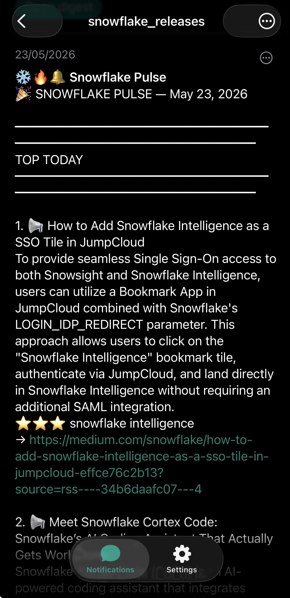

# 🔔 Snowflake Release Notifier

A self-hosted daily digest that monitors Snowflake release notes and the Snowflake blog, scores items against your keyword tiers, summarises the top picks with a local LLM (Ollama on Pi 2), and pushes a push notification to iOS / macOS via a self-hosted ntfy server on Pi 1. A daily HTML digest page is also rendered and served from Pi 2.

No API keys. No cloud inference. No data leaves the network.

---

<!-- ═══════════════════════════════════════════════════════════
     NOTIFICATION SCREENSHOT
     Capture: iPhone lock screen or ntfy app showing a Snowflake Pulse banner
     Ideal: dark mode, notification banner visible, score stars if possible
     Dimensions: 390×200px (iPhone lock screen crop)
     ═══════════════════════════════════════════════════════════ -->
<!--  -->

<!-- ═══════════════════════════════════════════════════════════
     DIGEST PAGE SCREENSHOT
     Capture: browser showing the digest at /digest/YYYY-MM-DD.html
     Show at least 2 top items with summaries and keyword pills visible
     Dimensions: 1200×700px
     ═══════════════════════════════════════════════════════════ -->
<!--  -->

---

## What it does

```
08:00 daily (systemd timer on Pi 2)
   │
   ├─ fetch  → Snowflake release notes  (html_scrape)
   ├─ fetch  → Snowflake on Medium      (RSS)
   │
   ├─ filter → dedupe against notified_urls.json
   │            html_scrape: no time gate (page lists full index)
   │            RSS:         24h gate    (continuous feed)
   │
   ├─ score  → keyword tiers in keywords.json
   │
   ├─ top 5 → Ollama llama3.2:3b → 1-2 sentence summary
   │
   ├─ render → /digest/YYYY-MM-DD.html (Jinja2 template, archive index)
   │
   └─ POST   → ntfy (Pi 1) → iPhone / macOS push
```

## ⚙️ Adapt to your domain

The keyword tiers in `keywords.json` are the only thing you need to change to track a different ecosystem. The pipeline, scoring, and delivery are domain-agnostic. See [Customization](#-customization) in the guide.

**Sources are equally swappable.** Add any RSS feed or HTML-scrape target to `sources.json` — dbt blog, dbt-core GitHub releases, Databricks blog, whatever your domain publishes.

## Architecture

```
┌──────────────── Pi 2 (vpi5-llm) ─────────────────┐
│                                                   │
│  notify_snowflake_releases.py                     │
│    ├─ fetch_html  →  docs.snowflake.com           │
│    ├─ fetch_rss   →  medium.com/snowflake         │
│    ├─ filter + score + summarize (Ollama)         │
│    ├─ render digest HTML  →  ~/openwebui/digest/  │
│    └─ POST ntfy                                   │
│                                                   │
│  nginx :443  /digest/  → ~/openwebui/digest/      │
└───────────────────────┬───────────────────────────┘
                        │ Tailscale
                        ▼
┌──────────────── Pi 1 (vpi5) ──────────────────────┐
│  ntfy container  →  nginx :443 /ntfy/             │
│                     nginx :8443 / (web UI)        │
└──────────────────────────┬────────────────────────┘
                           │ APNS bridge (topic name only)
                           ▼
                    iPhone / macOS
```

## Files

| File | Purpose |
|---|---|
| `notify_snowflake_releases.py` | Main script — fetch, filter, score, summarize, render, post |
| `keywords.json` | Keyword tiers (edit this to track your domain) |
| `sources.json` | Feed config — URLs, CSS selectors, enabled flags |
| `snowflake-notifier.service` | systemd oneshot service |
| `snowflake-notifier.timer` | systemd daily 08:00 timer |
| `templates/digest.html.j2` | Daily digest HTML template |
| `templates/index.html.j2` | Archive index template |
| `style.css` | Digest stylesheet (Fraunces + IBM Plex) |

## Quick reference

```bash
# Manual run (Pi 2)
sudo systemctl start snowflake-notifier.service

# Watch live logs
journalctl -u snowflake-notifier -f

# Check why a source returned 0 items
journalctl -u snowflake-notifier --since "today" | grep -E "fetched|WARNING|After"

# Inspect run state
cat ~/.local/share/snowflake-notifier/run_state.json

# Refresh stale CSS selector (see Troubleshooting in guide)
curl -s "https://docs.snowflake.com/en/release-notes/new-features" | \
  python3 -c "
import sys; from bs4 import BeautifulSoup
soup = BeautifulSoup(sys.stdin.read(), 'html.parser')
seen = set()
for a in soup.find_all('a', href=True):
    if '/release-notes/2' in a['href'] and a.get_text().strip():
        li = a.find_parent('li')
        if li and id(li) not in seen:
            seen.add(id(li))
            print(f'li={li.get(\"class\")} | {a.get_text().strip()[:60]}')
" | head -10
```

→ [Full setup guide](./guide.md)
